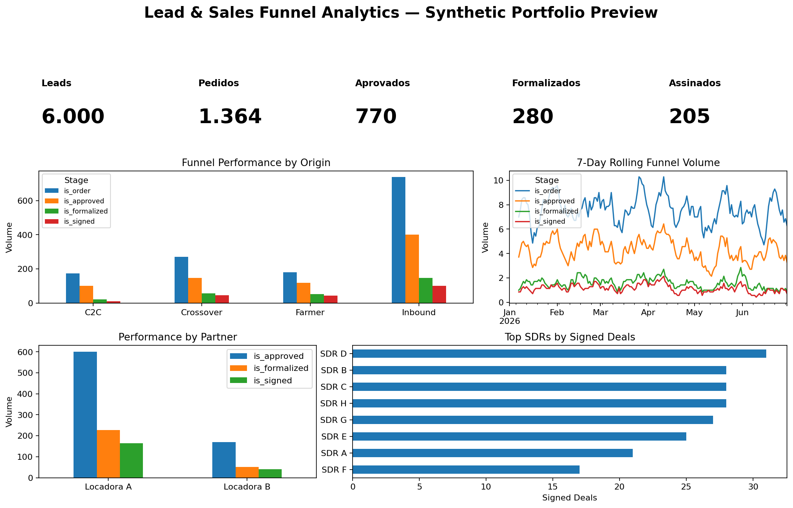

# 📊 Lead & Sales Funnel Analytics

> **Business Intelligence portfolio project built with Power BI, DAX, SQL and synthetic data.**

## 🎯 Overview

This project analyzes a commercial lead funnel from **lead generation to signed deals**, with the goal of identifying conversion bottlenecks, comparing acquisition origins and monitoring sales performance.

The project is based on the analytical structure of a professional BI use case, but **all company names, people, identifiers and business values have been replaced with synthetic data** for public portfolio use.

### Funnel

**Lead → Order → Credit Analysis → Approved → Formalized → Signed**

---

## 💼 Business Questions

- How many leads are entering the funnel?
- Which lead origins generate the highest volume?
- Where are the biggest conversion losses?
- Which rental partners have the strongest performance?
- Which SDRs generate the highest signed volume?
- How does performance evolve over time?
- Are formalized and signed volumes reaching their targets?
- Which channels generate the highest GMV?

---

## 🛠️ Tech Stack

| Tool | Purpose |
|---|---|
| **Power BI** | Dashboard and data visualization |
| **DAX** | KPIs, conversion rates and targets |
| **Power Query** | Data preparation |
| **SQL** | Funnel and performance analysis |
| **Data Modeling** | Analytical structure and KPI organization |

---

## 📁 Project Structure

```text
lead-sales-funnel-analytics/
│
├── data/
│   └── leads_synthetic.csv
│
├── sql/
│   ├── 01_schema.sql
│   ├── 02_funnel_analysis.sql
│   ├── 03_daily_performance.sql
│   ├── 04_locadora_analysis.sql
│   └── 05_sdr_performance.sql
│
├── powerbi/
│   ├── measures.dax
│   └── BUILD_GUIDE.md
│
├── docs/
│
└── README.md
```

---

## 📊 Dashboard



The Power BI dashboard is designed around five analytical areas:

### 1. Funnel Performance

Monitor the progression from leads to signed deals.

**KPIs:**
- Leads
- Orders
- Approved
- Formalized
- Signed
- Overall conversion

### 2. Origin Analysis

Compare performance across:

- Crossover
- Inbound
- Farmer
- C2C

### 3. Partner Performance

Analyze approval, formalization, signed volume and GMV by rental partner.

### 4. Daily Performance

Track funnel volume and conversion over time.

### 5. SDR Performance

Compare lead volume, conversion, signed deals and GMV by SDR.

---

## 🧮 Key DAX Measures

The project includes measures for:

- Funnel volume
- Conversion rates
- GMV
- Amount paid
- Target achievement
- Overall conversion

See [`powerbi/measures.dax`](powerbi/measures.dax).

---

## 🔎 SQL Analysis

The SQL layer contains queries for:

- Funnel performance by origin
- Daily conversion
- Partner performance
- SDR ranking

See the [`sql/`](sql/) folder.

---

## 🔐 Data Privacy

This repository **does not contain proprietary company data**.

The dataset was generated specifically for portfolio purposes and contains:
- Synthetic records
- Synthetic company/partner names
- Synthetic people identifiers
- Synthetic financial values

The analytical structure was inspired by a professional BI use case without reproducing confidential information.

---

## 🚀 How to Reproduce

### Option 1 — Power BI

1. Download `data/leads_synthetic.csv`
2. Import it into Power BI
3. Apply the measures from `powerbi/measures.dax`
4. Follow `powerbi/BUILD_GUIDE.md`
5. Build the dashboard using the recommended layout

### Option 2 — SQL

Load `data/leads_synthetic.csv` into a SQL environment and execute the scripts in the `sql/` folder.

---

## 📌 Portfolio Context

This project demonstrates an end-to-end BI workflow:

**Business Problem → Data → SQL → Data Modeling → DAX → Dashboard → Business Insights**

It is designed to demonstrate practical skills in **Business Intelligence and Data Analytics**, rather than simply showcasing visualization.

---

## 👤 Author

**Felipe Torrieri**

Business Intelligence & Data Analytics

[](https://www.linkedin.com/in/felipetorrieri/)

[](https://github.com/felipetorrieri)
