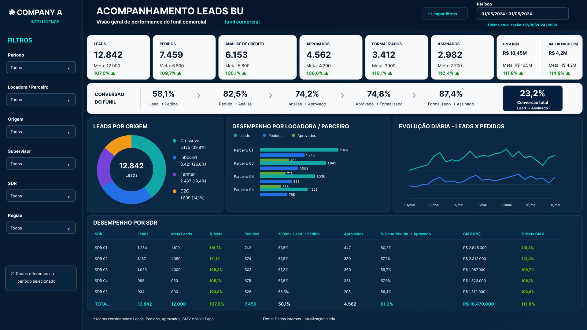

# 📊 Lead & Sales Funnel Analytics

> **End-to-end Business Intelligence project built with Power BI, DAX, Power Query and SQL, focused on commercial funnel performance and conversion analysis.**

## 🎯 Overview

This project presents a **commercial lead and sales funnel dashboard**, designed to monitor the customer journey from lead generation to signed deals.

The solution provides an executive and operational view of the funnel, helping identify **conversion bottlenecks, acquisition channel performance, partner results and SDR productivity**.

The analytical structure is inspired by a **real-world professional BI use case**. To preserve confidentiality, all company names, people, identifiers and business values were replaced with **synthetic data created specifically for this portfolio project**.

### 🔄 Sales Funnel

**Lead → Order → Credit Analysis → Approved → Formalized → Signed**

---

## 📊 Dashboard



The dashboard provides a centralized view of the commercial operation, combining funnel KPIs, targets, conversion rates and operational performance.

### Key Features

* 📈 Lead and sales funnel monitoring
* 🎯 Actual vs. target performance
* 🔄 Conversion rates between funnel stages
* 🧲 Lead acquisition origin analysis
* 🤝 Partner performance comparison
* 👤 SDR performance monitoring
* 💰 GMV and paid amount tracking
* 📅 Daily performance trends
* 🎛️ Interactive filtering by date, partner, origin, supervisor, SDR and region

---

## 💼 Business Questions

The dashboard was designed to answer questions such as:

* How many leads are entering the commercial funnel?
* What percentage of leads progress through each funnel stage?
* Where are the largest conversion losses?
* Which acquisition origins generate the highest volume?
* Which partners deliver the strongest commercial performance?
* Which SDRs have the highest conversion and signed volume?
* How is funnel performance evolving over time?
* Are commercial teams reaching their targets?
* Which segments contribute the most to GMV?

---

## 📌 Key Performance Indicators

The solution tracks the main stages and outcomes of the commercial funnel:

| KPI                    | Description                                         |
| ---------------------- | --------------------------------------------------- |
| **Leads**              | Total leads entering the funnel                     |
| **Orders**             | Leads converted into orders                         |
| **Credit Analysis**    | Orders submitted to credit analysis                 |
| **Approved**           | Customers approved after credit analysis            |
| **Formalized**         | Approved opportunities formally converted           |
| **Signed**             | Deals successfully signed                           |
| **GMV**                | Gross Merchandise Value generated                   |
| **Amount Paid**        | Financial amount effectively paid                   |
| **Conversion Rates**   | Conversion between each funnel stage                |
| **Target Achievement** | Actual performance compared with commercial targets |

---

## 🧠 Analytical Views

### 1. Funnel Performance

Tracks progression across the complete commercial journey:

**Lead → Order → Credit Analysis → Approved → Formalized → Signed**

Conversion rates make it possible to quickly identify stages where the largest funnel losses occur.

### 2. Lead Origin Analysis

Analyzes lead volume and distribution across acquisition sources such as:

* Crossover
* Inbound
* Farmer
* C2C

This view helps evaluate the contribution of each acquisition strategy to the top of the funnel.

### 3. Partner Performance

Compares commercial performance across partners using metrics such as:

* Leads
* Orders
* Approvals
* Formalizations
* Signed deals
* GMV

### 4. Daily Performance

Tracks lead and order volume over time, making it easier to identify trends, peaks and changes in commercial activity.

### 5. SDR Performance

Provides an operational view of individual SDR performance, including:

* Lead volume
* Target achievement
* Orders
* Conversion rates
* Approvals
* GMV
* GMV target achievement

---

## 🛠️ Tech Stack

| Technology        | Application                                        |
| ----------------- | -------------------------------------------------- |
| **Power BI**      | Dashboard development and data visualization       |
| **DAX**           | KPIs, funnel metrics, conversion rates and targets |
| **Power Query**   | Data cleaning and transformation                   |
| **SQL**           | Funnel, partner and SDR performance analysis       |
| **Data Modeling** | Analytical structure and metric organization       |

---

## 🧮 DAX Measures

The Power BI model includes measures for:

* Funnel stage volumes
* Stage-to-stage conversion rates
* Overall conversion
* GMV
* Amount paid
* Target achievement
* Commercial performance indicators

The main measures are documented in:

[`powerbi/measures.dax`](powerbi/measures.dax)

---

## 🔎 SQL Analysis

The SQL layer complements the dashboard with queries focused on different analytical perspectives.

### Included analyses

* Funnel performance by acquisition origin
* Daily commercial performance
* Partner performance
* SDR performance and ranking

SQL scripts are available in:

[`sql/`](sql/)

---

## 📁 Project Structure

```text
lead-sales-funnel-analytics/
│
├── data/
│   └── leads_synthetic.csv
│
├── docs/
│   ├── dashboard.png
│   └── data_dictionary.md
│
├── powerbi/
│   ├── measures.dax
│   └── BUILD_GUIDE.md
│
├── sql/
│   ├── 01_schema.sql
│   ├── 02_funnel_analysis.sql
│   ├── 03_daily_performance.sql
│   ├── 04_locadora_analysis.sql
│   └── 05_sdr_performance.sql
│
└── README.md
```

---

## 🔐 Data Privacy

This repository **does not contain proprietary or confidential company data**.

The dataset was generated specifically for portfolio purposes and contains:

* Synthetic commercial records
* Synthetic company and partner names
* Synthetic employee identifiers
* Synthetic financial values
* No customer or personally identifiable information

The analytical structure was inspired by a professional BI use case while preserving the confidentiality of the original business context.

---

## 🚀 How to Reproduce

### Power BI

1. Download [`data/leads_synthetic.csv`](data/leads_synthetic.csv)
2. Import the dataset into Power BI
3. Transform and validate the data using Power Query
4. Create the measures documented in [`powerbi/measures.dax`](powerbi/measures.dax)
5. Follow the analytical structure described in [`powerbi/BUILD_GUIDE.md`](powerbi/BUILD_GUIDE.md)
6. Build the dashboard and interactive filters

### SQL

Load `data/leads_synthetic.csv` into your preferred SQL environment and execute the scripts available in the [`sql/`](sql/) directory.

---

## 📌 What This Project Demonstrates

This project showcases an end-to-end Business Intelligence workflow:

**Business Problem → Data Preparation → SQL Analysis → Data Modeling → DAX → Dashboard → Business Insights**

Beyond dashboard development, the project demonstrates the ability to translate a **commercial business process into measurable KPIs and analytical views**, supporting both executive monitoring and operational decision-making.

### Skills Demonstrated

`Power BI` · `DAX` · `SQL` · `Power Query` · `Data Modeling` · `Data Visualization` · `KPI Development` · `Sales Funnel Analysis` · `Business Intelligence`

---

## 👤 Author

**Felipe Torrieri**

Business Intelligence & Data Analytics

[](https://www.linkedin.com/in/felipetorrieri/)

[](https://github.com/felipetorrieri)
